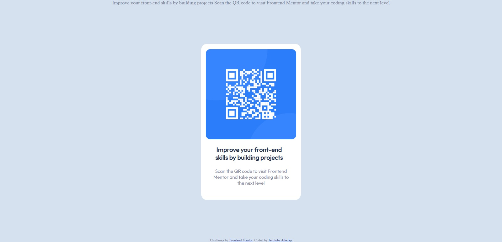

# Frontend Mentor - QR code component solution

This is a solution to the [QR code component challenge on Frontend Mentor](https://www.frontendmentor.io/challenges/qr-code-component-iux_sIO_H). Frontend Mentor challenges help you improve your coding skills by building realistic projects.

## Overview

This is a QR code component developed by Jesutoba Adedeji using HTML and CSS with tools like flexbox for a responsive page.

### Screenshot



### Links

- Solution URL: [Add solution URL here](https://your-solution-url.com)
- Live Site URL: [Add live site URL here](https://your-live-site-url.com)

## My process

I started with studying the design using figma and creating a similar design using the one given as a template. Then I went on to code the design with HTML. When I was done with HTML, I moved on to styling with CSS, using the font-family,font-sizes and colors that were given.

### Built with

- Semantic HTML5 markup
- CSS custom properties
- Flexbox

### What I learned

I learnt how to use figma for UI designs and how to properly translate designs to code using figma.

```css
body {
  display: flex;
  flex-direction: column;
  justify-content: space-between;
  align-items: center;
}
```

### Continued development

### Useful resources

## Author

- Website - [Jesutoba Adedeji]
- Frontend Mentor - [@yjesutobaadedejidev](https://www.frontendmentor.io/profile/jesutobaadedejidev)
- Twitter - [@DejiObani](https://twitter.com/DejiObani)

## Acknowledgments

I want to thank God almighty for the grace and tenacity given to me to be able to complete this project. I hope to have the discipline to learn more and complete many more projects.
